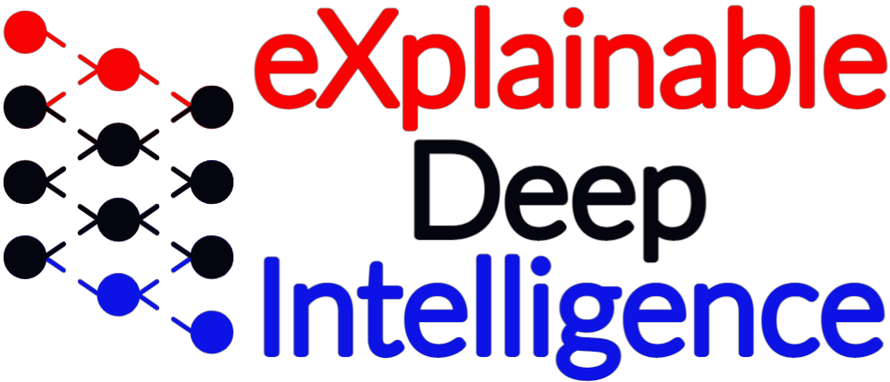

<a id="readme-top"></a>

<!-- PROJECT SHIELDS -->

[![Contributors][contributors-shield]][contributors-url]
[![Issues][issues-shield]][issues-url]
[![project\_license][license-shield]][license-url]

<!-- PROJECT LOGO -->

<br />
<div align="center">
  <a href="https://github.com/xdilab/VR_Watch">
    
  </a>

<h3 align="center">Sundown – Galaxy Watch Module</h3>

  <p align="center">
This repository contains the Samsung Galaxy Watch component of the Sundown research platform. The watch application is responsible for continuous physiological and motion data collection during VR sessions, including heart rate, HRV, stress metrics, and accelerometer data. Data is logged locally and synchronized with the VR system to enable unified, multimodal analysis.
    <br />
    <a href="https://github.com/xdilab/VR_Watch"><strong>Explore the docs »</strong></a>
    <br />
    <br />
    <a href="https://github.com/xdilab/VR_Watch">View Demo</a>
    &middot;
    <a href="https://github.com/xdilab/VR_Watch/issues/new?labels=bug">Report Bug</a>
    &middot;
    <a href="https://github.com/xdilab/VR_Watch/issues/new?labels=enhancement">Request Feature</a>
  </p>
</div>

<!-- TABLE OF CONTENTS -->

<details>
  <summary>Table of Contents</summary>
  <ol>
    <li>
      <a href="#about-the-project">About The Project</a>
      <ul>
        <li><a href="#built-with">Built With</a></li>
      </ul>
    </li>
    <li>
      <a href="#getting-started">Getting Started</a>
      <ul>
        <li><a href="#prerequisites">Prerequisites</a></li>
        <li><a href="#installation">Installation</a></li>
      </ul>
    </li>
    <li><a href="#usage">Usage</a></li>
    <li><a href="#architecture">Architecture Overview</a></li>
    <li><a href="#connection-overview">Connection Overview</a></li>
    <li><a href="#troubleshooting">Troubleshooting</a></li>
    <li><a href="#roadmap">Roadmap</a></li>
    <li><a href="#license">License</a></li>
    <li><a href="#contact">Contact</a></li>
    <li><a href="#acknowledgments">Acknowledgments</a></li>
  </ol>
</details>

<!-- ABOUT THE PROJECT -->

## About The Project

The Sundown Galaxy Watch module functions as the physiological sensing layer of the overall Sundown system. It runs as a foreground Android service on a Samsung Galaxy Watch and continuously captures biometric and motion data during VR sessions. The watch app is designed for reliability, low user interaction, and long-session stability, ensuring consistent data capture even when the app is backgrounded.

Captured data is timestamped and written to CSV files, enabling alignment with VR eye tracking, head pose, and session events.

<p align="right">(<a href="#readme-top">back to top</a>)</p>

### Built With

* Kotlin (Android)
* Android Wear OS
* Android SensorManager
* Foreground Services
* CSV-based data logging

<p align="right">(<a href="#readme-top">back to top</a>)</p>

<!-- GETTING STARTED -->

## Getting Started

This section explains how to install the signed Sundown Watch APK on a Samsung Galaxy Watch using ADB and wireless debugging.

### Prerequisites

Before installation, ensure you have:

* Samsung Galaxy Watch (Wear OS)
* Watch and computer connected to the same Wi‑Fi network
* Android SDK Platform Tools (ADB)

  * Download: [https://developer.android.com/tools/releases/platform-tools](https://developer.android.com/tools/releases/platform-tools)
* The signed release APK (`app-release.apk`)

### Installation

#### Step 1: Prepare the Watch

1. Enable Developer Mode

   * On the watch: **Settings → About Watch → Software Info**
   * Tap **Software Version** 7 times until Developer Mode is enabled

2. Enable Wireless Debugging

   * Go to **Settings → Developer Options**
   * Enable **ADB Debugging**
   * Enable **Wireless Debugging**

> Ensure the watch and computer are on the same Wi‑Fi network.

#### Step 2: Open a Terminal

1. Open the extracted `platform-tools` directory
2. Place `app-release.apk` inside this folder

**Windows**

* Right‑click → *Open in Terminal* (or PowerShell)

**macOS**

* Open Terminal, `cd` into the platform‑tools directory

#### Step 3: Pair and Connect ADB

1. On the watch, open **Wireless Debugging → Pair new device**
2. Note the **IP address and pairing port** and the **6‑digit pairing code**

Run the pairing command:

```sh
adb pair <IP:PAIRING_PORT>
```

Enter the pairing code when prompted.

3. From the main Wireless Debugging screen, note the **IP address and connection port**

Connect:

```sh
adb connect <IP:PORT>
```

You should see `Connected to ...`

#### Step 4: Install the APK

```sh
adb install app-release.apk
```

If reinstalling:

```sh
adb install -r app-release.apk
```

Once complete, the app will appear in the watch app drawer.

<p align="right">(<a href="#readme-top">back to top</a>)</p>

<!-- USAGE -->

## Usage

1. Launch the **Sundown Watch** app from the app drawer
2. **Grant ALL requested permissions** (sensors, activity recognition, notifications) — the app will not function correctly if any permissions are denied. You can re-grant them at any time via the watch's app settings.
3. The foreground service will start automatically — **no further interaction is required**
4. Sensor data is logged continuously to a CSV file in internal storage
5. Data collection persists while the app is backgrounded

> **Note:** The watch app displays **no UI, visuals, or status indicators** during operation. A blank or inactive screen does not mean the app has stopped — it is silently running the background service. This is by design.

<p align="right">(<a href="#readme-top">back to top</a>)</p>

<!-- ARCHITECTURE -->

## Architecture Overview

**Main Components**

* `MainActivity.kt`

  * Handles runtime permissions
  * Starts the foreground service

* `ForegroundWorker.kt`

  * Foreground service for continuous sensing
  * Collects heart rate, HRV, stress, and accelerometer data
  * Writes timestamped CSV logs

* `AndroidManifest.xml`

  * Declares required permissions
  * Registers the foreground service

This modular structure ensures reliable background execution and clean separation of responsibilities.

<p align="right">(<a href="#readme-top">back to top</a>)</p>

<!-- CONNECTION OVERVIEW -->

## Connection Overview

The Sundown Watch communicates with the VR headset using **BLE (Bluetooth Low Energy)** — a fundamentally different protocol from standard Bluetooth used for pairing headphones or speakers. Understanding this distinction is critical to correct operation.

The system follows a standard **BLE Peripheral/Central model**:

| Role | Device | Behavior |
|------|--------|----------|
| Peripheral | Galaxy Watch | Advertises a custom BLE GATT service UUID in the background |
| Central | VR Headset | Scans for the custom UUID and connects automatically |

### How it works

1. The **Sundown Watch app** launches and immediately begins broadcasting a custom BLE GATT service in the background. No UI is shown — this is expected behavior.
2. The **VR application** loads and begins scanning for that specific service UUID.
3. A connection is formed automatically and metrics are recorded in the background.
4. Confirm connection by checking that the **watch's device ID appears in the connected channels** section of the Unity developer panel.

> **Note:** Some tracking text fields in the Unity dev panel have a known display bug and may not update correctly. Use the watch ID in connected channels as your sole indicator of connection status.

<p align="right">(<a href="#readme-top">back to top</a>)</p>

<!-- TROUBLESHOOTING -->

## Troubleshooting

### ❌ Do NOT manually pair the watch via Bluetooth settings

This is the most common cause of connection failure.

Manually pairing a device through your system's Bluetooth settings creates a **Classic Bluetooth / bonded connection**, which operates on a completely different layer from BLE service advertising. This will interfere with — and can outright block — the automatic BLE service discovery the application depends on.

**Bluetooth only needs to be _enabled_. Do not pair the devices manually.**

### Correct setup steps

1. On both the watch and headset, go to Bluetooth settings and **remove/forget any existing pairing** between the two devices
2. Ensure Bluetooth is **toggled ON** on both devices — do not re-pair them
3. Launch the **Sundown Watch** app — it will begin broadcasting silently in the background
4. Launch the **VR application** — it will automatically detect and connect to the watch's BLE service
5. Confirm connection via the watch ID in the Unity developer panel's connected channels section

### ⚠️ Proximity interference (multiple setups)

Since all watches broadcast the **same custom BLE service UUID**, a nearby VR headset cannot distinguish between two watches in the same physical space. It will connect to whichever advertisement it detects first, which can cause cross-connection between users' devices.

**Workaround:** Do not run two setups simultaneously in the same room. Test one setup at a time and ensure the other setup's watch app and VR application are not actively running.

> A long-term fix (unique service UUIDs per device) is tracked on the [Roadmap](#roadmap).

<p align="right">(<a href="#readme-top">back to top</a>)</p>

<!-- ROADMAP -->

## Roadmap

* [x] Foreground service–based sensor collection
* [x] Heart rate and HRV logging
* [x] Accelerometer XYZ capture
* [x] CSV-based persistent logging
* [x] Permission and background execution handling
* [ ] Improve long-session battery efficiency
* [ ] Strengthen reconnection and fault tolerance
* [ ] Expand physiological metrics as APIs allow
* [ ] Unique BLE service UUIDs per device to prevent proximity interference

<p align="right">(<a href="#readme-top">back to top</a>)</p>

<!-- LICENSE -->

## License

© 2025 eXplainable Deep Intelligence Lab  
Developed under Hamidzera Moradi.  
Primary author: Kirsten Hefney.

This project is licensed under the **GNU General Public License v3.0**.  
See the [LICENSE](./LICENSE) file for full terms and conditions.

<p align="right">(<a href="#readme-top">back to top</a>)</p>

<!-- CONTACT -->

## Contact

Kirsten Hefney – [khefney@aggies.ncat.edu](mailto:khefney@aggies.ncat.edu)

Project Link: [https://github.com/xdilab/VR_Watch](https://github.com/xdilab/VR_Watch)

<p align="right">(<a href="#readme-top">back to top</a>)</p>

<!-- ACKNOWLEDGMENTS -->

## Acknowledgments

This project was developed at **eXplainable Deep Intelligence Lab** under the supervision of **Dr. Hamidzera Moradi**.

Thanks to lab members and collaborators for feedback, testing, and system‑level discussions supporting the Sundown research platform.

<p align="right">(<a href="#readme-top">back to top</a>)</p>

<!-- MARKDOWN LINKS -->

[contributors-shield]: https://img.shields.io/github/contributors/xdilab/Sundown_Watch.svg?style=for-the-badge
[contributors-url]: https://github.com/xdilab/VR_Watch/graphs/contributors
[issues-shield]: https://img.shields.io/github/issues/xdilab/VR_Watch.svg?style=for-the-badge
[issues-url]: https://github.com/xdilab/VR_Watch/issues
[license-shield]: https://img.shields.io/github/license/xdilab/VR_Watch.svg?style=for-the-badge
[license-url]: https://github.com/xdilab/VR_Watch/blob/main/LICENSE
